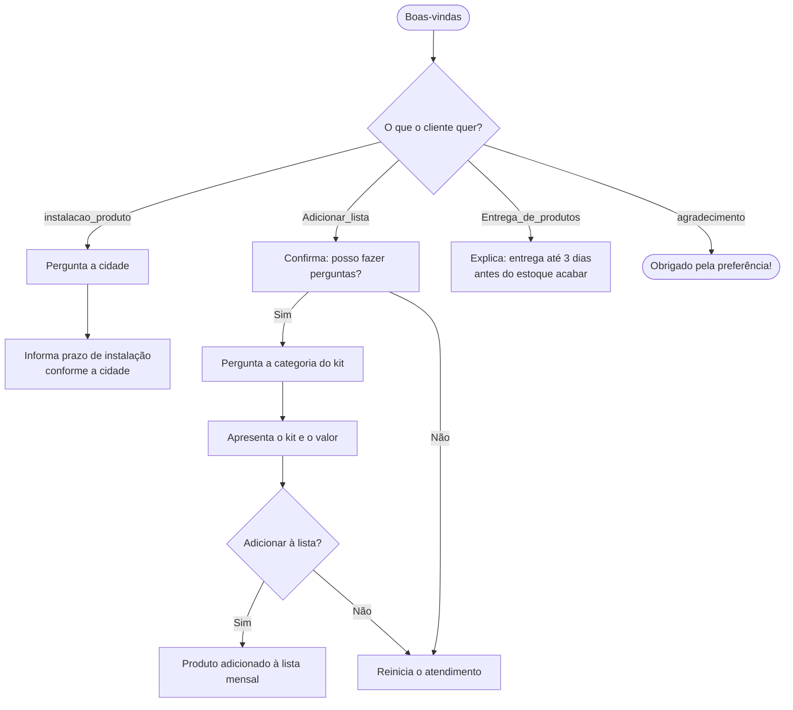

<h1 align="center">🤖 AbasteceBot — CasaAbastecida</h1>

<p align="center">
  <i>Chatbot de atendimento para uma startup de reabastecimento automático de produtos domésticos.</i>
</p>

<p align="center">
  
  
  
  
</p>

---

## 📌 Sobre o projeto

O **AbasteceBot** é o assistente virtual da **CasaAbastecida**, uma startup de **reabastecimento automático**: sensores instalados na casa do cliente monitoram o estoque e solicitam a reposição dos produtos **antes que eles acabem**.

O chatbot foi construído no **IBM watsonx Assistant** e atende os clientes em português, ajudando em três frentes principais: **instalação dos dispositivos**, **gestão da lista de produtos** e **dúvidas sobre entrega**.

## ✨ O que o bot faz

- 🔧 **Instalação dos sensores** — informa o prazo de instalação de acordo com a cidade do cliente.
- 📝 **Adicionar produtos à lista mensal** — guia o cliente na escolha da categoria e do kit a ser incluído.
- 🚚 **Dúvidas sobre entrega** — explica que os produtos chegam em até 3 dias antes do estoque acabar.
- 🙏 **Encerramento cordial** — responde a agradecimentos e reinicia o atendimento quando necessário.

## 🧠 Intents (intenções)

| Intent | Para que serve |
|---|---|
| `instalacao_produto` | Cliente quer instalar/ativar os dispositivos. |
| `Adicionar_lista` | Cliente quer aumentar a lista de produtos da despensa. |
| `Entrega_de_produtos` | Cliente pergunta sobre prazo e estimativa de entrega. |
| `agradecimento` | Cliente agradece / encerra o atendimento. |

## 🏷️ Entities (entidades)

| Entity | Valores |
|---|---|
| `@cidade` | São Paulo, Rio de Janeiro, Minas Gerais, Espírito Santo |
| `@categoria_produto` | Chocolate, Mercearia, Padaria |
| `@sim_nao` | Sim, Não |
| `@sys-currency` | *(entidade de sistema — valores monetários)* |

> ⏱️ **Prazos de instalação por cidade:** São Paulo (10 dias úteis) • Rio de Janeiro (12) • Minas Gerais (15) • Espírito Santo (17).

## 🗺️ Fluxo do diálogo



## 🚀 Como importar e testar

Este repositório contém o arquivo de exportação do **dialog skill** do watsonx Assistant.

1. Acesse o **[IBM watsonx Assistant](https://www.ibm.com/products/watsonx-assistant)** e faça login.
2. Crie (ou abra) um assistente e vá em **Actions/Dialog → Skills**.
3. Escolha **Import skill / Upload** e selecione o arquivo:
   ```
   Atendimento-Startup-Abastecebot-dialog.json
   ```
4. Após importar, use o **"Try it"** (painel de teste) para conversar com o bot.

### 💬 Exemplos de conversa

```text
Você: Quero instalar o produto
Bot:  Excelente! Qual cidade você mora?
Você: São Paulo
Bot:  Perfeito! Realizamos a instalação em até 10 dias úteis.

Você: Em quanto tempo as compras chegam?
Bot:  Seus produtos serão entregues até 3 dias antes de acabar seu estoque.
```

## 🛠️ Tecnologias

<p align="left">
  
  
  
</p>

## 👥 Autora

| Nome 
|---|---|
| Thays Lira de Oliveira 


---

<p align="center">
  Projeto acadêmico desenvolvido na <strong>FIAP</strong> — Análise e Desenvolvimento de Sistemas 🎓
</p>
